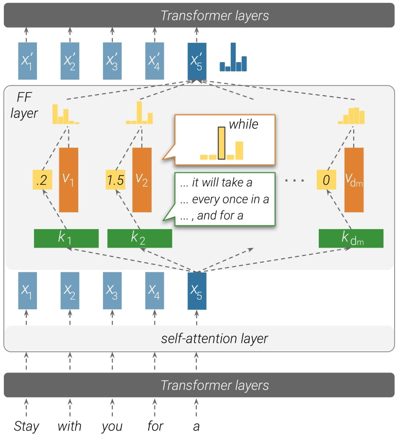

# Transformer Feed-Forward Layers Are Key-Value Memories
This repository includes the accompanying code for the paper "[Transformer Feed-Forward Layers Are Key-Value Memories](https://arxiv.org/abs/2012.14913)". Mor Geva, Roei Schuster, Jonathan Berant, and Omer Levy. EMNLP, 2021.

The code is built upon the fairseq framework, and includes changes at the core modules that allow extraction of activations and predictions as described in the paper. Overall, the code provides three main components: 
1. Identifying trigger examples for keys in the network
2. Computing agreement between keys and values
3. Extracting value and layer predictions for analysis

The experiments reported in the paper were conducted in a **python 3.6.8** environment. The code was developed over [this version](https://github.com/pytorch/fairseq/tree/8e48f45aa469bbff85613520ffc161c0850e4744) of fariseq. 

<p align="center"></p>

### :gear: Requirements

- Install our modified version of fairseq:
```bash
git clone https://github.com/mega002/ff-layers
cd ff-layers
pip install --editable ./

# on MacOS:
# CFLAGS="-stdlib=libc++" pip install --editable ./
```
- Download data and model: 
  - From [here](examples/language_model/README.md), download the model `transformer_lm.wiki103.adaptive`.
  - Follow the instructions [here](examples/language_model/README.md#1-preprocess-the-data) to download and preprocess the WikiText-103 dataset.


### 🔬 Identifying trigger examples

The script `generate_outputs.py` is the main entry point for extracting key activations (for trigger example identification) and layer/value predictions from the network.

Identification of trigger examples is done by passing `--get_trigger_examples` as an argument, and (optional) specifiying the number of trigger examples to extract per key (with the argument `top_k_trigger_examples`). 

The script can operate globally on all keys in the network, or on specific dimensions specified in the argument `dims_for_analysis`. Below are two sample execution commands:
1. This command extracts the top 50 trigger examples from the first 1M sentences in the training set, for all keys in the network.
```bash
python analysis/generate_outputs.py \
--data_file examples/language_model/wikitext-103/wiki.train.tokens \
--model_dir checkpoints/adaptive_lm_wiki103.v2/ \
--get_trigger_examples \
--max_sentences 1000000 \
--top_k_trigger_examples 50  \
--extract_mode layer-raw \
--output_file top50_train_1000000sents.jsonl
```

2. This command extracts the top 50 trigger examples from the full training set, for the keys at dimensions `222` and `1001` in all layers.
```bash
python analysis/generate_outputs.py \
--data_file examples/language_model/wikitext-103/wiki.train.tokens --model_dir checkpoints/adaptive_lm_wiki103.v2/ \ --get_trigger_examples \
--max_sentences -1 \
--top_k_trigger_examples 50  \
--extract_mode layer-raw \
--dims_for_analysis 222 1001 \
--output_file 222_1001_top50_train_allsents.jsonl
```

To convert the output `jsonl` file to easy to read textual files (one per key), use the script `trigger_examples_jsonl_to_textual.py`, as follows:
```bash
python analysis/trigger_examples_jsonl_to_textual.py \
--input_file top50_train_1000000sents.jsonl \
--model_dir checkpoints/adaptive_lm_wiki103.v2 \
--output_dir top50_train_1000000sents_output
```

### 🔬 Computing agreement between keys and values
The script `key_value_agreement.py` computes the prediction for each value in the network, and match it against the trigger examples of the corresponding key.

The script assumes that trigger examples were identified for all keys in the network. Note that to produce reasonable results the trigger examples should be extracted from a fair amount of examples from the training data (ideally the entire training set). 

To run the script, use the following command, where `data_dir` is a directory produced by the script `trigger_examples_jsonl_to_textual.py`.
```bash
python analysis/key_value_agreement.py \
--model_dir checkpoints/adaptive_lm_wiki103.v2/ \
--data_dir top50_train_1000000sents_output \
--output_base key_value_top50_train_1000000sents_output
```

The script will produce a `tsv` and a `json` files under the name provided in `output_base`.

Please note that this analysis requires ~150GB RAM.

### 🔬 Extracting value and layer predictions
To extract value and layer predictions (for producing the experiments in section 5 in the paper), run the script `generate_outputs.py` , while passing `--extract_ffn_info` as an argument and choosing the extraction mode `dim`/`layer` with `--extract_mode`.

Here is a sample execution command that extracts data for the full validation set, at a dimension level:
```bash
python analysis/generate_outputs.py \
--data_file examples/language_model/wikitext-103/wiki.valid.tokens \
--extract_ffn_info \
--max_sentences 1000 \
--model_dir checkpoints/adaptive_lm_wiki103.v2/ \
--extract_mode dim \
--output_file dim_valid_1000sents.pkl
```

The difference between the extraction modes is that `dim` extract information for each value in the network, and `layer` extract aggregated information over all values for each layer. Running in `dim` mode is more expensive in terms of running time (please see [here](#:warning:-Note-about-running-time)).

The output will be a pickled pandas DataFrame, storing all the information extracted. 

### :warning: Note about running time
The running time of `generate_output.py` might be long, as identifying meaningful trigger examples requires executing the model over lots of examples from the training set. In addition, using the `dim` extraction mode requires iterating over all dimensions of all layers for each example.

Below are running time measurments benchmarked on a single GPU, model NVIDIA GeForce RTX 3090:

| **analysis** | **extract_mode** | **max_sentences** | running time
---|---|---|---
`get_trigger_examples` | `layer-raw` | 1000 | ~0.75 hour
`extract_ffn_info` | `layer` | -1<br>(full validation set) | ~9.8 hours
`extract_ffn_info` | `dim` | 1000 | ~4.2 hours

Processing the entire training set with `get_trigger_examples` can be done faster by splitting the data and running the script in parallel on multiple GPUs.

[comment]: <> (python analysis/generate_outputs.py --data_file ../ffn_layers/examples/language_model/wikitext-103/wiki.valid.tokens --extract_ffn_info --max_sentences -1 --model_dir ../ffn_layers/checkpoints/adaptive_lm_wiki103.v2/ --extract_mode layer --output_file tmp_layer_-1.pkl)
[comment]: <> (--- 35362.37753152847 seconds ---)
[comment]: <> (~9.8 hours)

[comment]: <> (python analysis/generate_outputs.py --data_file ../ffn_layers/examples/language_model/wikitext-103/wiki.valid.tokens --extract_ffn_info --max_sentences 1000 --model_dir ../ffn_layers/checkpoints/adaptive_lm_wiki103.v2/ --extract_mode dim --output_file tmp_dim_1000.pkl)
[comment]: <> (--- 15052.624953985214 seconds ---)
[comment]: <> (~4.2 hours)

[comment]: <> (python analysis/generate_outputs.py --data_file ../ffn_layers/examples/language_model/wikitext-103/wiki.train.tokens --model_dir ../ffn_layers/checkpoints/adaptive_lm_wiki103.v2/ --get_trigger_examples --max_sentences 1000000 --top_k_trigger_examples 50  --extract_mode layer-raw --output_file tmp_1000000.jsonl)


### Citation
Please cite as:
```bibtex
@inproceedings{geva2020transformer,
    title={Transformer Feed-Forward Layers Are Key-Value Memories},
    author={Geva, Mor and Schuster, Roei and Berant, Jonathan and Levy, Omer},
    booktitle = {Empirical Methods in Natural Language Processing (EMNLP)},
    year={2021},
}
```
